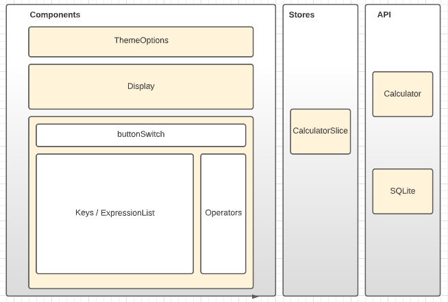

# React Native, Typescript, Redux and SQLite


This is an essential example to build React-native app using Typescript, Redux and SQLite.


## Features

- Typescript
- Redux
- SQLite
- Theme


## Component Structure


[](./images/paths.png)


## Directory Structure

```
root
:
├── src
:   ├── api
    |   ├── calculator.ts
    |   ├── IExpression.ts
    |   └── sqlite-expressions.ts
    ├── components
    |   ├── Display.component.tsx
    |   ├── ExpressionsList.tsx
    |   ├── Keyboard.component.tsx
    |   ├── KeyButton.component.tsx
    |   └── ThemeOptions.components.tsx
    ├── stores
    |   ├── calculatorSlice.ts
    |   ├── hooks.ts
    |   └── index.ts
    └── themes
:       └── index.ts
├── App.tsx
├── LICENSE
├── README.md
:
```

## Dependencies


    - "@react-navigation/native": "^6.0.11"
    - "@reduxjs/toolkit": "^1.8.3"
    - "react": "18.0.0"
    - "react-native": "0.69.3"
    - "react-native-safe-area-context": "^4.3.1"
    - "react-native-sqlite-storage": "^6.0.1"
    - "react-redux": "^8.0.2"
    - "redux": "^4.2.0"


## Usage


Clone this project and simple run

```sh
- git clone https://www.github.com/murilordg/react-native-calculator
- npm i
- react-native run-android
- react-native start
```


## Author


Murilo I.Rodrigues, murilo@raciocinio.com.br


## License


React Native Typescript Calculator is available under the MIT license. See the LICENSE file for more info.

